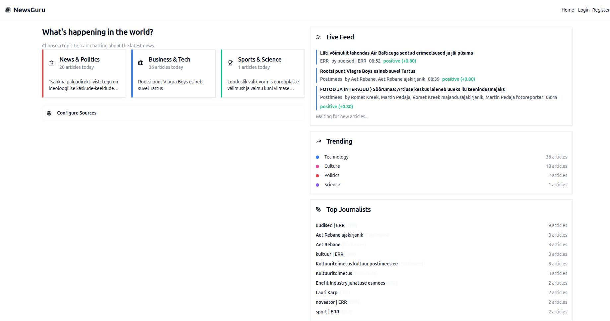
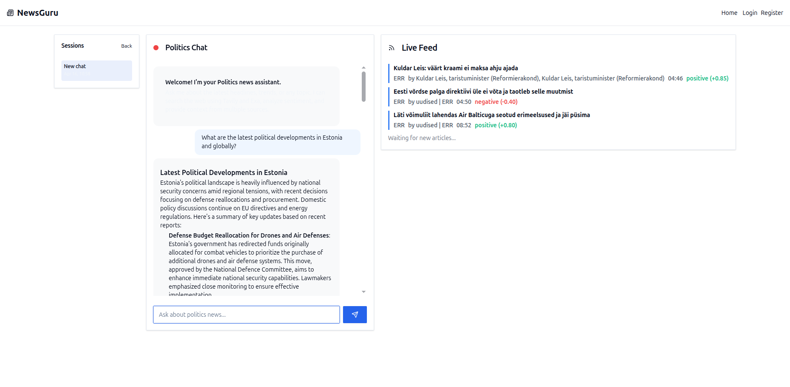
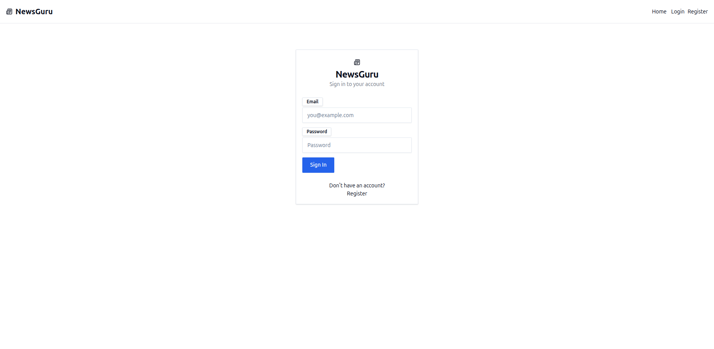
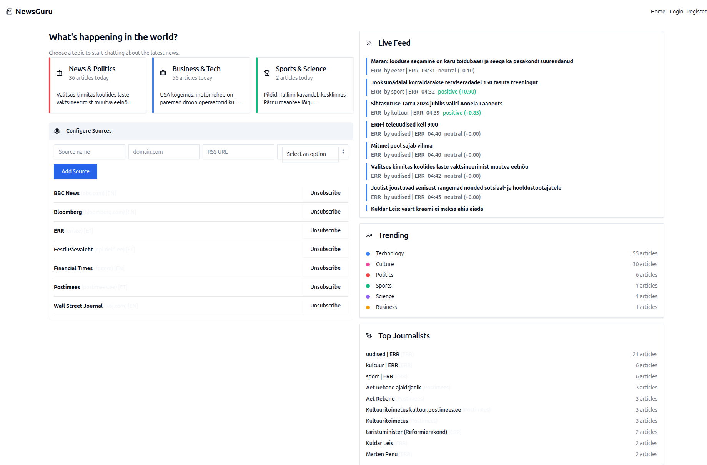

# NewsGuru

AI-powered chat-based news aggregator built with FastHTML, LangChain, and xAI Grok.

## Screenshots

| Homepage | Chat with AI |
|----------|-------------|
|  |  |

| Login | Configure Sources |
|-------|-------------------|
|  |  |

## Demo Video

See [docs/demo_video.mp4](docs/demo_video.mp4) for a full walkthrough, or [docs/demo_video.gif](docs/demo_video.gif) for an animated preview.

## Features

- **3 Topic Cards** -- News & Politics, Business & Tech, Sports & Science -- click to enter AI chat
- **AI Chat** powered by xAI Grok (grok-4-fast-reasoning) with tool-calling: Tavily search, Exa neural search, article database queries
- **Real-time SSE Live Feed** -- new articles pushed to the UI as they are ingested
- **RSS Aggregation** from 7 sources: Postimees, EPL, ERR (Estonian) + WSJ, FT, Bloomberg, BBC (English)
- **LLM Sentiment Scoring** -- every article scored positive/negative/neutral with confidence
- **Journalist Tracking** -- authors extracted and tracked across articles
- **Trending Topics** -- real-time topic popularity based on article counts
- **Thinking Indicator** -- animated dots + rotating status (Thinking... / Searching Tavily... / Composing response...)
- **HTML-formatted responses** -- chat output rendered as proper HTML, not raw markdown
- **Configure Sources** -- expandable panel to add/remove/subscribe/unsubscribe news sources
- **Login / Register** -- session-based authentication
- **PWA / Responsive** -- mobile-friendly with hidden sidebars on small screens
- **Docker ready** -- single-container deployment for Coolify at newsguru.chat

## Tech Stack

| Layer | Technology |
|-------|-----------|
| Frontend | FastHTML + MonsterUI + HTMX SSE |
| LLM | LangChain + ChatOpenAI (xAI base_url) with grok-4-fast-reasoning |
| Search Tools | Tavily (web search) + Exa (neural search) |
| Database | PostgreSQL (newsguru schema) via SQLAlchemy + psycopg2 |
| RSS | feedparser |
| Scraping | newspaper4k |
| Realtime | SSE (htmx-ext-sse) push every ~20s |

## Quick Start

```bash
# Clone and setup
git clone <repo-url>
cd newsguru
uv venv && source .venv/bin/activate
uv pip install -e .

# Configure environment
cp .env.example .env
# Edit .env with your keys: XAI_API_KEY, DB_URL, TAVILY_API_KEY, EXA_API_KEY

# Run database migration
python db/migrate.py

# Start the app
python main.py
# Open http://localhost:5020
```

## Docker Deployment

```bash
docker compose up --build -d
# App available at http://localhost:5020
```

For Coolify: point to this repo, set environment variables, deploy as Docker Compose. Domain: `newsguru.chat`

## Environment Variables

| Variable | Required | Description |
|----------|----------|-------------|
| `DB_URL` | Yes | PostgreSQL connection string |
| `XAI_API_KEY` | Yes | xAI API key for Grok LLM |
| `TAVILY_API_KEY` | No | Tavily search API key |
| `EXA_API_KEY` | No | Exa neural search API key |

## Database Schema

12 tables under PostgreSQL schema `newsguru`:

`users`, `profiles`, `sources`, `articles`, `article_sentiments`, `topics`, `article_topics`, `journalists`, `journalist_articles`, `chat_sessions`, `chat_messages`, `trending_snapshots`

## Project Structure

```
newsguru/
  main.py              # FastHTML app, routes, SSE, startup
  config.yaml          # News sources, topics, settings
  sql/schema.sql       # PostgreSQL DDL
  db/                  # Database pool + migration
  services/            # RSS, scraper, search, sentiment, chat, scheduler
  components/          # FastHTML UI components
  tests/               # Test suite + video capture
  docs/                # Demo video + frames
  Dockerfile           # Container build
  docker-compose.yaml  # Compose orchestration
```

## Tests

```bash
# Smoke tests
python -m pytest tests/test_suite.py -v

# Capture demo video (requires app running + playwright installed)
python tests/capture_video.py
```

## News Sources

**Estonian**: Postimees, Eesti Paevaleht, ERR

**English**: Wall Street Journal, Financial Times, Bloomberg, BBC News

Sources can be added/removed via the Configure Sources panel on the homepage.
